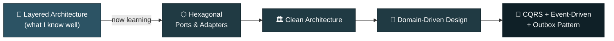
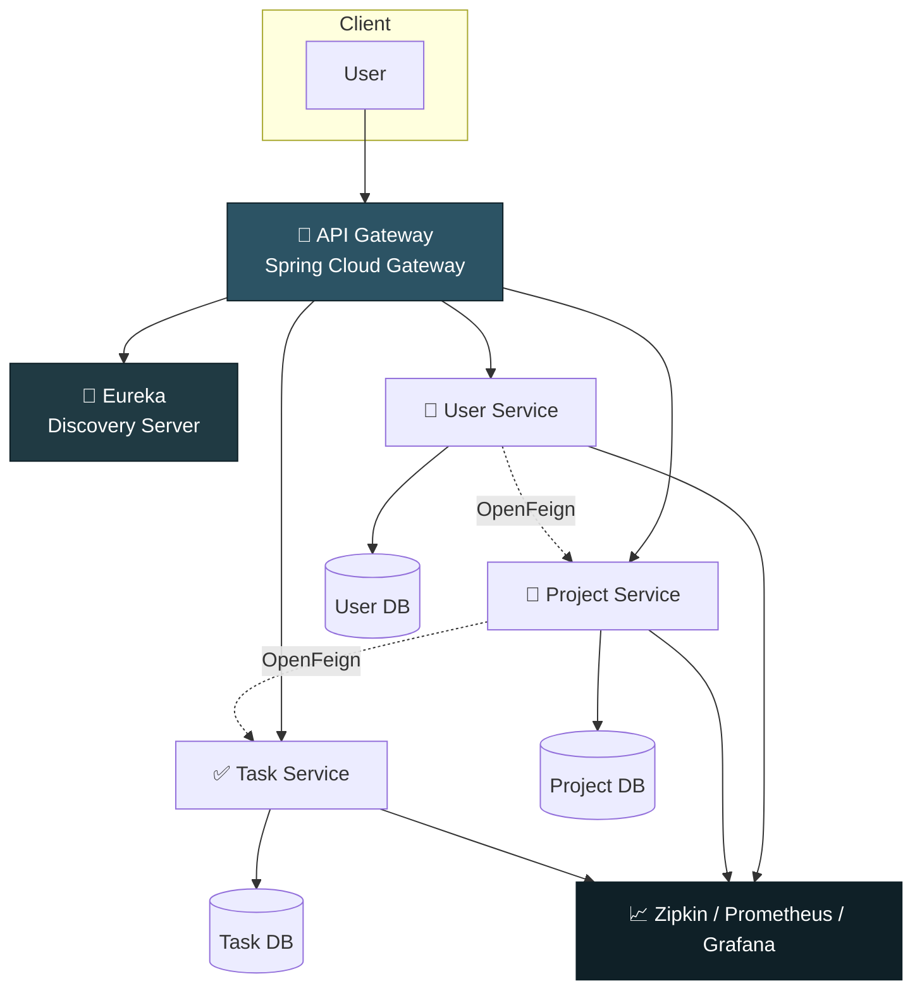
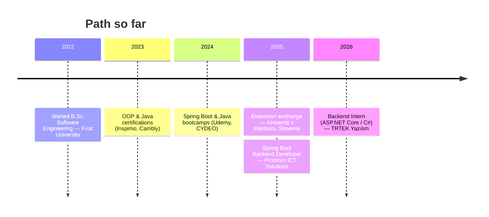

<div align="center">


<br/>

<a href="https://beraterkul.com.tr"></a>
<a href="https://www.linkedin.com/in/berat-erkul"></a>
<a href="https://medium.com/@beraterkul00"></a>
<a href="mailto:beraterkul00@gmail.com"></a>


</div>

<br/>

## 👋 About Me

I'm a **Junior Java Backend Developer** from Kocaeli, Türkiye — Software Engineering student at Fırat University, with an Erasmus+ exchange semester at Univerza v Mariboru, Slovenia 🇸🇮. I build backend systems with **Spring Boot**, break monoliths into **microservices**, and ship them with **Docker + AWS + CI/CD**.

I learn by rebuilding — every pattern in this profile started life as a project I tore down and reassembled just to understand *why* it exists.

```java
public class BeratErkul implements BackendDeveloper {

    private final String[] stack   = {"Java", "Spring Boot", "PostgreSQL", "Docker", "AWS"};
    private final String   focus   = "Migrating monoliths → microservices, one bounded context at a time";
    private       boolean  coffee  = true;

    @Override
    public void philosophy() {
        while (coffee) {
            write(cleanCode());
            test(everything());
            refactor(fearlessly());
        }
    }
}
```

<br/>

## 🧭 The Architecture Journey I'm On

For most of my hands-on work so far I've lived in **classic 3-layer / layered architecture** — Controller → Service → Repository, simple and effective. Right now I'm deliberately climbing out of that comfort zone for the first time, so consider this diagram a live status, not a finished résumé:



> 🙋 Honest note: DDD, Clean and Hexagonal Architecture are brand new to me — I'm seeing them for the first time beyond theory. If you've walked this road, I'd genuinely love a code review or a pointer.

<br/>

## 🛠️ Tech Stack

<div align="center">


<br/><br/>


</div>

<br/>

## 🚀 Featured Work

<table>
<tr>
<td width="50%" valign="top">

### 🎫 Ticketing System — v1
**Layered Monolith**

The same product, rebuilt twice on purpose — this is the "before".

- Controller–Service–Repository layers
- Keycloak + Spring Security auth, password hashing
- AOP performance monitoring, global exception handling
- Dockerized → AWS EC2 + RDS
- CircleCI → AWS ECR pipeline

[`ticketing-project-data →`](https://github.com/berat-erkul/ticketing-project-data)

</td>
<td width="50%" valign="top">

### ⚙️ TicketinApp — v2
**Microservices Rewrite**

User / Project / Task services + Gateway + Eureka + Config Server — the "after".

- Netflix Eureka service discovery
- Spring Cloud Gateway + OpenFeign
- Centralized config + client-side load balancing
- Distributed tracing: Zipkin, Prometheus, Grafana
- Independent database per service

[`TicketinApp →`](https://github.com/berat-erkul/TicketinApp)

</td>
</tr>
</table>



<br/>

## 📊 GitHub Stats

<div align="center">


</div>

<details>
<summary>🏆 Trophy Case (click to expand)</summary>

<div align="center">

</div>

</details>

<br/>

## 🎓 Background



- 📜 Certified: **CYDEO** Backend/Spring Boot Developer Program, plus Udemy courses in Spring Boot, Java, C++ and Relational DB Design
- 🌍 English — B2 Professional Working Proficiency

<br/>

<div align="center">

## 🎸 Off the Keyboard

Guitar, singing, and an unreasonable amount of curiosity about why things break in production.

**Let's connect — especially if you know DDD, Clean or Hexagonal Architecture and have opinions.**

<a href="mailto:beraterkul00@gmail.com"></a>
<a href="https://www.linkedin.com/in/berat-erkul"></a>


</div>
